# Portfolio-VaR-Risk-Analysis

## 1. Portfolio Universe
 
### SOFR Payer Swap
 
| Field | Value |
|---|---|
| Notional | $100,000,000 |
| Strike | 4.20% per annum |
| Swap Maturity | 12 years (Oct 30, 2023 – Oct 30, 2035) |
| Payment Frequency | Annual (both legs) |
| Position | Payer — pay fixed, receive float |
 
The payer swap position profits when SOFR rises above 4.20%, since the floating receipts exceed the fixed payments. As of October 30, 2023, the 1Y SOFR stood at **5.22%** and the 12Y SOFR at **4.43%** — both above the 4.20% strike — placing the swap **in-the-money**.
 
### Equity Positions
 
Historical data window: **251 trading days** (Oct 31, 2022 – Oct 30, 2023)
 
| Ticker | Position | Sector |
|---|---|---|
| AAPL | $1,000,000 | Technology |
| MSFT | $1,000,000 | Technology |
| F (Ford Motor) | $1,000,000 | Automotive |
| BAC (Bank of America) | $1,000,000 | Banking |
| **Total** | **$4,000,000** | **4 stocks** |
 
**Total portfolio value: ~$6.987M** (equity $4M + swap mark-to-market)
 
---
 
## 2. Market Data & Risk Factor Overview
 
### SOFR Curve Behaviour (Oct 2022 – Oct 2023)
 
The SOFR curve experienced significant upward pressure across all tenors driven by the Federal Reserve's aggressive hiking cycle (11 rate hikes beginning March 2022).
 
| Tenor Range | Cumulative Rate Change |
|---|---|
| 1D and 3M (short end) | +130 to +138 bps |
| 12Y (long end) | +70 bps |

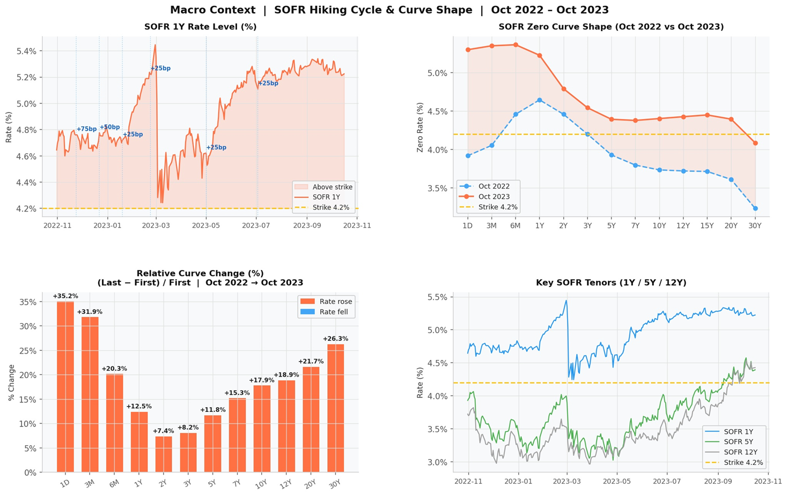

The non-parallel shift structure of the curve — short end moving nearly twice as much as the long end — motivated the decision to model **all 30 SOFR tenors as individual risk factors** rather than applying a simplifying parallel-shift assumption.
 
### Equity Performance (normalized to 100 at start of window)
 
| Ticker | 1-Year Return | Commentary |
|---|---|---|
| MSFT | +46.7% | Driven by AI/tech rally |
| AAPL | Positive | Tech rally tailwind |
| F | −19.7% | Affected by macro rate environment |
| BAC | −26.7% | Bank deposit outflow and credit risk fears |
 
The stark divergence between tech and financials/automotive reflects the cross-asset nature of the 2022–23 rate shock: technology stocks were largely shielded by AI-driven growth narratives, while banking stocks absorbed credit and deposit risk repricing.

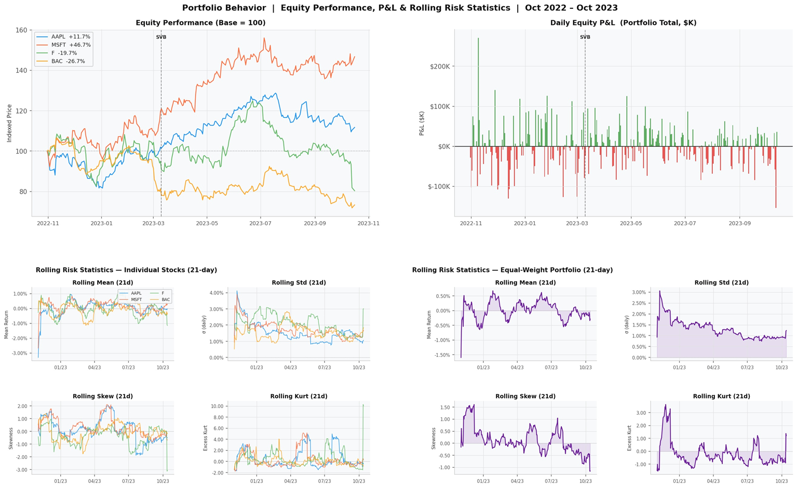

---
 
## 3. Risk Factor Covariance Structure
 
The full risk model spans **34 risk factors**: 30 SOFR curve tenors + 4 equity returns.
 
### SOFR Tenor Volatilities (daily, in bps)
 
| Tenor | Daily Volatility |
|---|---|
| 1D (short end) | ~14 bps (highest) |
| 2Y–3Y (mid curve) | ~9 bps |
| **12Y (swap tenor)** | **~6.8 bps** |
 
The mid-curve (2Y–3Y) showed elevated volatility reflecting policy path uncertainty. The 12Y tenor, directly relevant to the swap's duration exposure, had a daily volatility of ~6.8 bps.

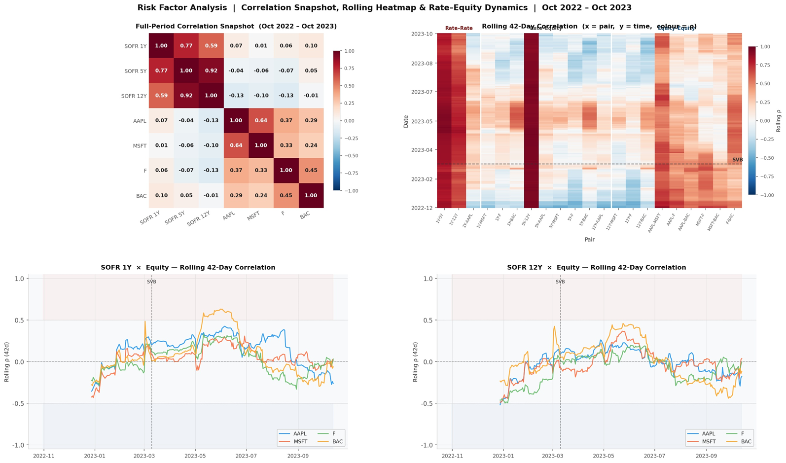
 
### Equity Volatilities (daily)
 
| Ticker | Daily Volatility | Annualised (approx.) |
|---|---|---|
| F | 2.28% | ~36% |
| BAC | ~2.1% | ~33% |
| MSFT | ~1.8% | ~29% |
| AAPL | 1.58% | ~25% |
 
### Equity Correlation Matrix
 
| | AAPL | MSFT | F | BAC |
|---|---|---|---|---|
| AAPL | 1.00 | 0.64 | — | 0.29 |
| MSFT | 0.64 | 1.00 | — | — |
| F | — | — | 1.00 | — |
| BAC | 0.29 | — | — | 1.00 |
 
The AAPL–MSFT correlation of **0.64** (highest pair) and AAPL–BAC of **0.29** (lowest pair) indicate meaningful diversification benefit across the equity book. The **34×34 covariance matrix Σ** — combining all SOFR tenor and equity volatilities and cross-correlations — serves as the shared input for all three VaR models.
 
---
 
## 4. Parametric VaR
 
### Methodology
 
The Parametric (variance-covariance) approach assumes risk factor changes are jointly normally distributed. Portfolio P&L variance is derived analytically using the sensitivity vector **δ** and the covariance matrix **Σ**:
 
```
Portfolio Variance = δᵀ Σ δ
1-Day 95% VaR     = 1.645 × √(Portfolio Variance)
```
 
Swap sensitivities (DV01s) are computed via **finite differencing**: each SOFR tenor rate is bumped by a small amount sequentially while all others are held fixed, and the change in swap NPV is recorded. Equity sensitivities are simply the dollar position sizes (delta = $1M per stock).
 
### Results
 
| Component | Standalone 95% VaR |
|---|---|
| SOFR Swap | $1.034M |
| Equity Book | $0.088M |
| **Portfolio (combined)** | **$1.033M** |

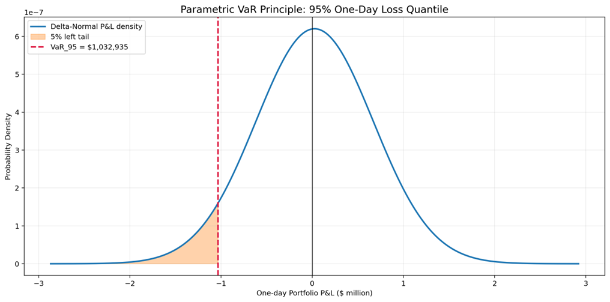

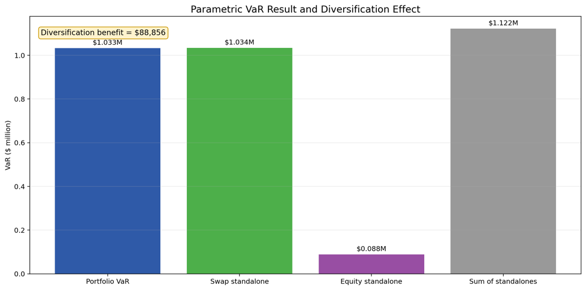


**Portfolio 1-day 95% Parametric VaR: $1.033M** (~14.8% of portfolio value)
 
The portfolio VaR is *lower* than the sum of the standalone VaRs ($1.122M), demonstrating a **diversification benefit** — the swap and equity positions are not perfectly correlated, so their worst-case losses do not coincide.
 
---
 
## 5. Monte Carlo VaR
 
Both approaches share the same simulation backbone:
 
1. Estimate the historical covariance matrix **Σ** from the time series
2. Cholesky-decompose **Σ = LLᵀ**
3. Sample **z ~ N(0, I)** and compute correlated shocks **X = Lz**
4. Run **10,000 simulations**
5. Report the **5th percentile** of the simulated portfolio P&L distribution

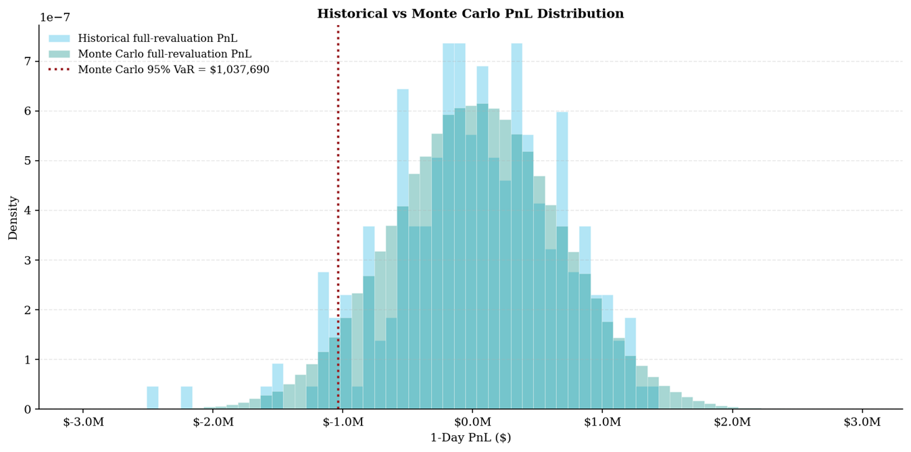

### Full Revaluation Approach
 
For each of the 10,000 scenarios, the correlated rate shocks are applied to the current SOFR curve and the swap is **fully repriced** (recalculating discount factors, forward rates, and NPV from scratch). Simulated equity returns are applied directly to the $1M position sizes. Portfolio P&L is the sum of swap P&L and equity P&L across all scenarios.
 
### Sensitivity-Based Approach
 
Rather than full repricing, the swap P&L for each scenario is approximated using the pre-computed **DV01 sensitivities** per tenor:
 
```
Swap ΔPV ≈ Σ (DV01_i × Δrate_i)   for i = 1 to 30 tenors
```
 
This is computationally faster but relies on the linearity assumption holding over a 1-day horizon.
 
### Results
 
| Approach | 1-Day 95% VaR |
|---|---|
| Full Revaluation | **$1,037,690** |
| Sensitivity-Based | **$1,031,213** |

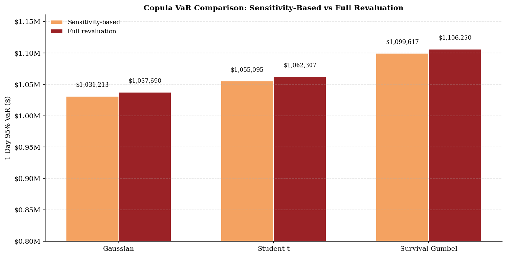

The two estimates are very close (~$6.5K difference), confirming that the **linear sensitivity approximation is a good proxy** over a 1-day horizon for this portfolio. The small gap is due to convexity effects captured by full repricing but not by the linear delta approximation.
 
---
 
## 6. Monte Carlo VaR — Copula Extensions
 
### Motivation
 
Standard Monte Carlo assumes a Gaussian (linear correlation) dependence structure. However, during market stress, asset correlations typically **increase in the tails** — a feature that Gaussian correlation cannot capture. Copulas allow the marginal distributions of each risk factor to be modelled separately from their joint dependence structure.
 
### Copulas Tested

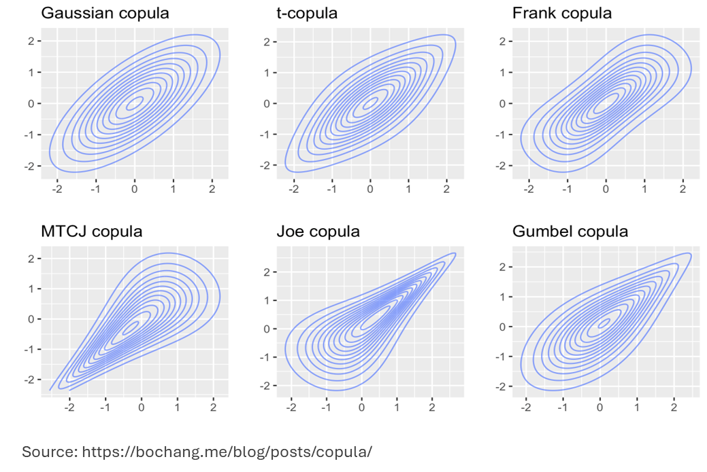

| Copula | Dependence Characteristic |
|---|---|
| Gaussian | Linear correlation only; no tail dependence |
| Student-t | Symmetric tail dependence; heavier joint tails |
| Survival Gumbel | Asymmetric upper-tail dependence; captures crash co-movements |
 
### Results
 
| Copula | Sensitivity-Based VaR | Full Revaluation VaR |
|---|---|---|
| Gaussian | ~$1.06M | ~$1.07M |
| Student-t | ~$1.06M | ~$1.07M |
| Survival Gumbel | ~$1.10M | ~$1.11M |
 
The **Survival Gumbel copula produces the highest VaR** (~$1.10–1.11M), indicating that when stronger tail dependence is incorporated, the portfolio appears riskier. The Gaussian assumption used in the base Monte Carlo model **slightly understates downside risk** in stressed environments. This copula analysis serves as a robustness check on the base MC estimates.
 
---
 
## 7. Historical VaR
 
### Methodology
 
Historical VaR makes no parametric distributional assumption — it applies the **actual observed daily market moves** from the historical window directly to today's portfolio.

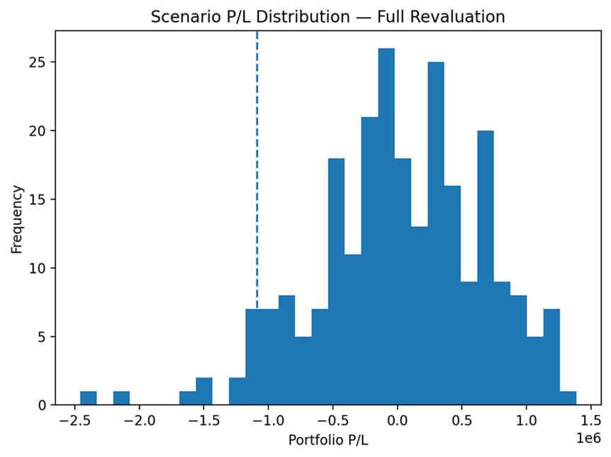

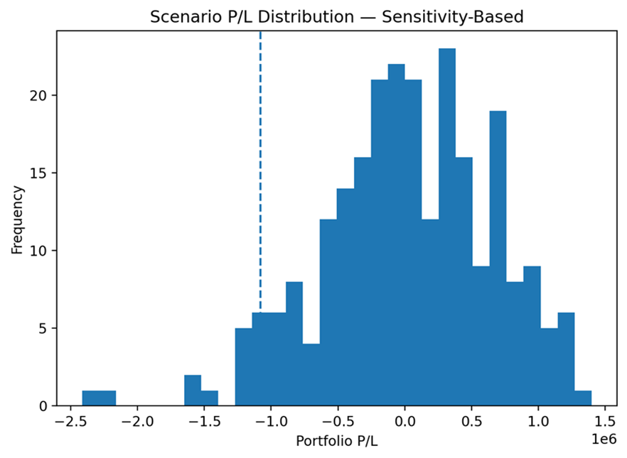

#### Swap — Sensitivity-Based
 
1. Compute `dV/drate` (DV01) for each relevant tenor (1Y through 12Y) as of Oct 30, 2023
2. For each historical day, extract the observed daily change in each tenor's zero rate
3. Approximate daily swap P&L as: `ΔPV ≈ Σ (DV01_i × Δrate_i)`
 
#### Swap — Full Revaluation
 
1. For each of the 248 historical days, shift the Oct 30, 2023 zero curve by that day's observed rate changes across all tenors
2. Fully reprice the swap on the shifted curve (discount factors → forward rates → float and fixed leg NPVs)
3. Record the daily change in swap NPV
 
#### Equities
 
For each historical day, compute the daily log return for each stock and apply it to the $1M position:
 
```
Equity P&L_i = Daily Return_i × $1,000,000
```
 
Portfolio P&L = Swap P&L + Sum of Equity P&Ls
 
### Percentile Estimation
 
With 248 observations, the 5th percentile (95% VaR) is identified two ways:
 
- **Discrete:** 5% × 248 = 12.4 → take the **13th worst loss** (more conservative)
- **Interpolation:** Interpolate between the 12th and 13th worst observations

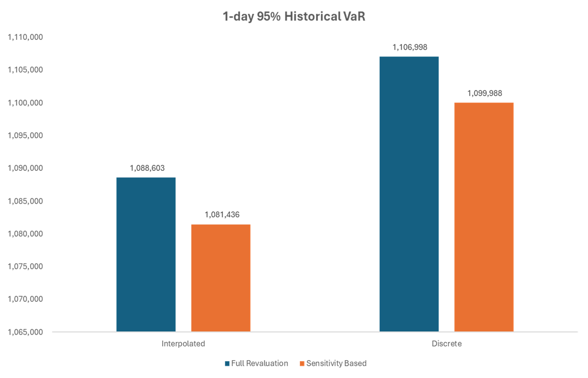

### Results
 
| Approach | 1-Day 95% VaR |
|---|---|
| Sensitivity-Based | **$1.081M** |
| Full Revaluation | **$1.088M** |
 
Historical VaR is **~5% higher** than the Parametric and Monte Carlo estimates. This is because the 2022–23 Fed hiking cycle was an unusually volatile period for interest rates — the historical data directly encodes those fat-tailed rate moves, whereas the Gaussian-based models smooth them out.
 
### Advantages of Historical VaR
 
- **No distributional assumption** required for daily risk factor changes
- **Correlations are implicit** — the empirical joint distribution of all 34 risk factors is used as-is, without estimating a correlation matrix
- Naturally captures **regime-specific dynamics** (e.g., the hiking cycle volatility cluster)
 
### Key Assumption
 
Historical VaR assumes that **the past is representative of the future**. In unusual macro regimes or structural breaks, this backward-looking approach may not capture forward-looking tail risks adequately.
 
---
 
## 8. Expected Shortfall (CVaR)
 
VaR answers: *"What is the loss threshold at the 95th percentile?"* It says nothing about the severity of losses beyond that threshold.

**Expected Shortfall (ES)** — also called Conditional VaR (CVaR) — answers: *"Given that we breach VaR, what is the average loss?"* It is the mean of all P&L outcomes in the worst 5% tail.

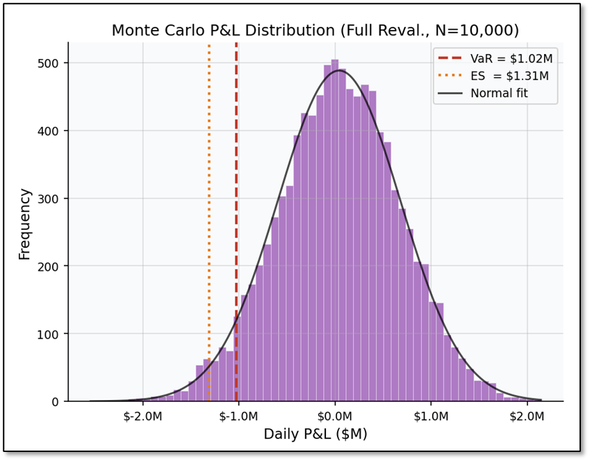

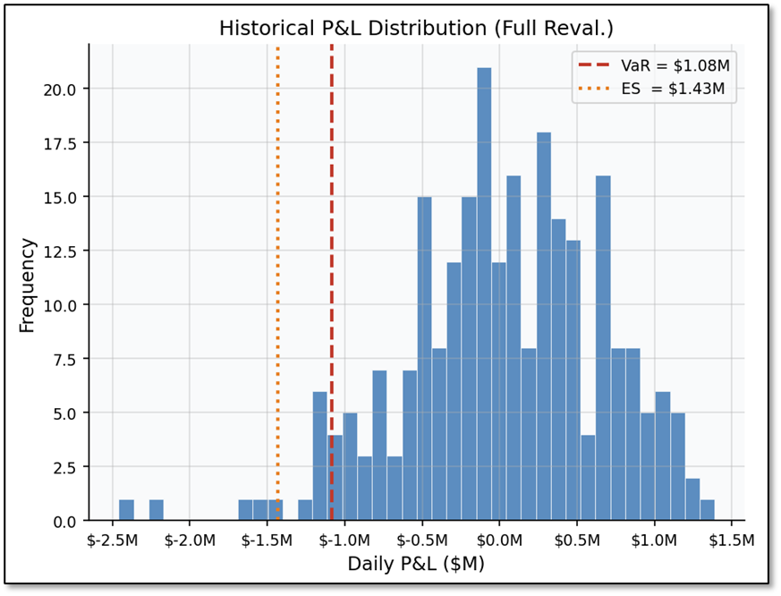

- *ES is consistently ~26% higher than VaR across all methods*; meaning when we do breach VaR, we’d expect to lose about $250–400k more on top.
- *Historical ES ($1.43M) > MC/Parametric ES (~$1.30M)*; because the 2022-23 Fed hiking cycle was an unusually fat-tailed environment for rates, and historical sim captures that directly while MC assumes normality. The Fed hiked interest rates a total of 11 times starting in March 2022.

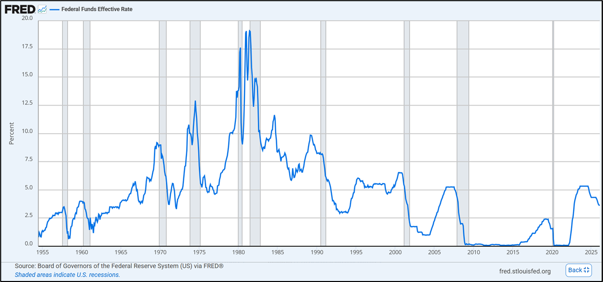

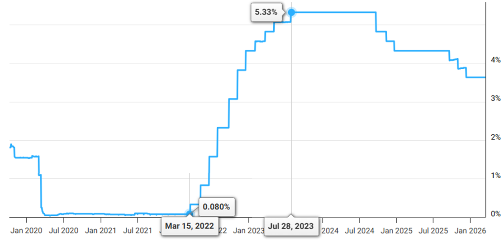

## 9. Convexity

Convexity answers: How many simulations do we need?

- *VaR* and *ES* are both quite noisy below ~1,000 simulations.
- They stabilize around *3,000–4,000 runs*. Beyond that, extra computations with negligible precision.
- The error decays at $\frac{1}{\sqrt{N}}$, which we can see empirically matching the theoretical curve, validating that the simulation and doesn’t break; if we double our simulations, the error doesn't halve as it only reduces by a factor of $\sqrt{2}$; steep drop early on, then diminishing returns.

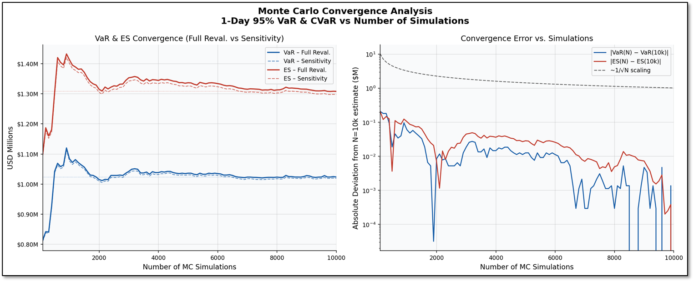

*As 𝑁 → ∞, where does the answer converge too?*; MC value converges to the parametric result.

- MC and parametric are built on the same assumption: both fit a multivariate normal to the historical data and work within that.
- MC is essentially just numerically sampling from the same normal distribution that parametric solves analytically. Given enough simulations, they must agree.
- Historical simulation is fundamentally different as it uses the actual observed scenarios without imposing any distributional assumption. So, it captures the real fat tails and skewness from the 2022–23 rate hiking period, which is why it gives a higher VaR and ES.
- The gap between MC/parametric ($1.03M) and historical ($1.08M) is the cost of the normality assumption.

### Full Results Summary
 
| Method | Approach | 1-Day 95% VaR | 1-Day 95% ES | VaR/ES Ratio | Notes |
|---|---|---|---|---|---|
| Parametric | — | $1.033M | $1.302M | 0.793 | Normal assumption, closed-form |
| Monte Carlo | Sensitivity | $1.031M | $1.298M | 0.785 | 10,000 simulations, linear approx. |
| Monte Carlo | Full Reval. | $1.038M | $1.308M | 0.782 | 10,000 simulations, full reprice |
| Historical | Sensitivity | $1.081M | $1.419M | 0.760 | 248 days, linear approx. |
| Historical | Full Reval. | $1.088M | $1.431M | 0.758 | 248 days, full reprice |

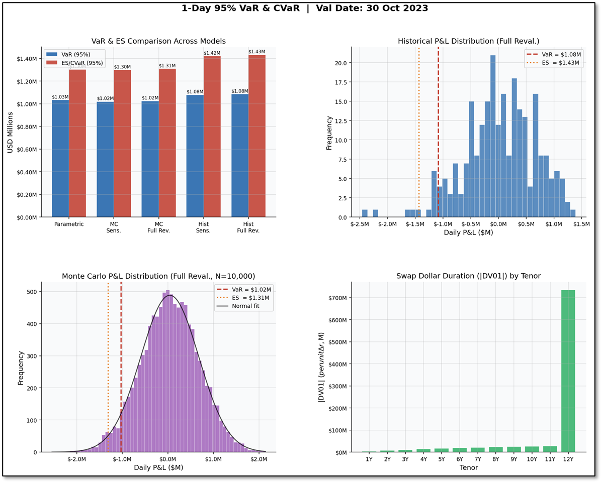

### Key Observations
 
**ES is consistently ~26% higher than VaR across all methods.** When the portfolio does breach the 95% VaR threshold, the expected additional loss is approximately **$250K–$400K** beyond the VaR figure.
 
**Historical ES ($1.43M) > MC/Parametric ES (~$1.30M)** because the 2022–23 Fed hiking cycle generated an unusually fat-tailed distribution of rate changes. The historical simulation captures those extreme observations directly, while Monte Carlo and Parametric methods assume normality and therefore understate tail severity.
 
---
 
## 10. Model Comparison & Key Takeaways
 
### VaR Estimates at a Glance
 
| Model | Approach | 1-Day 95% VaR |
|---|---|---|
| Parametric | — | $1.033M |
| Monte Carlo | Sensitivity | $1.031M |
| Monte Carlo | Full Reval. | $1.038M |
| Historical | Sensitivity | $1.081M |
| Historical | Full Reval. | $1.088M |
 
### Structural Insights
 
**Swap dominates portfolio risk.** The standalone swap VaR ($1.034M) is approximately 12× the standalone equity VaR ($0.088M), despite the equity book being larger in dollar terms. This reflects the enormous notional ($100M) and the duration exposure of the 12-year swap.
 
**Diversification benefit is real but modest.** The combined portfolio VaR is lower than the sum of standalone VaRs, but because the swap already dominates, the diversification contribution of the equity book is marginal.
 
**Parametric ≈ Monte Carlo (Gaussian).** By design — both assume normally distributed risk factors. The small differences are due to simulation noise in MC.
 
**Historical > Gaussian-based models.** The 2022–23 rate environment was a fat-tailed regime. Historical simulation captures this directly; Gaussian models do not.
 
**Full revaluation ≈ Sensitivity-based** over a 1-day horizon. Linear delta approximation holds well for short horizons, validating the use of sensitivity-based methods as a fast approximation.
 
**Copula choice matters for tail risk.** Survival Gumbel copula raises VaR by ~6% vs. Gaussian, highlighting that dependence structure assumptions can have a meaningful impact on tail risk estimates.
 
---
